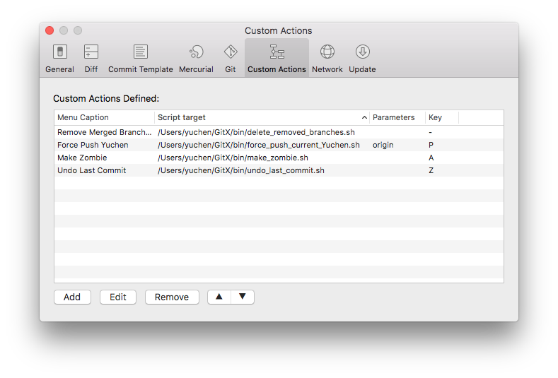
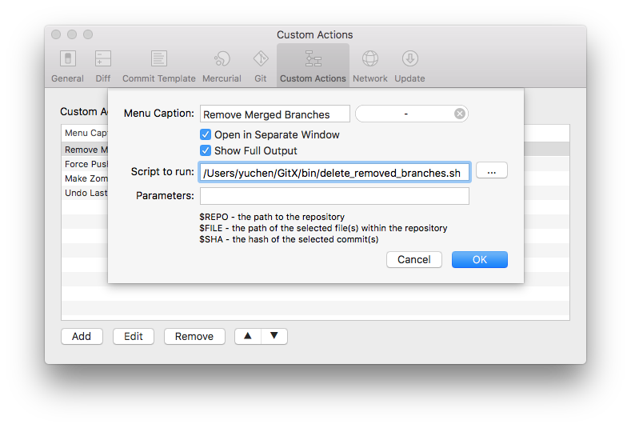
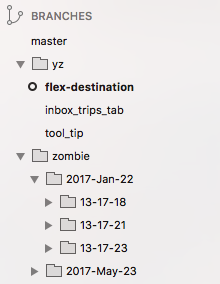
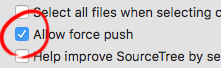
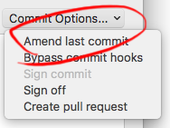
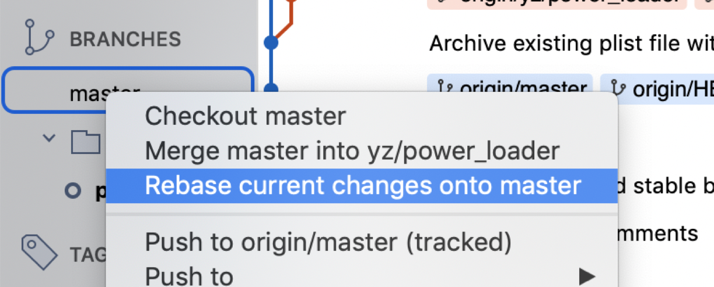

# SourceTree Custom Actions

This [GitHub repo](https://github.com/yzhong52/SourceTreeX) contains a list of useful SourceTree custom actions. Building with existing git command, it extends the SourceTree functionalities. For example, you can **delete merged branches** to quickly keep the remote clean; and you can **undo the last commit** if you made a mistake. 

To use the custom actions here, simply checkout the repo on your machine. In SourceTree, open Preferences by <kbd>⌘</kbd> + <kbd>,</kbd> and then click on the "Custom Actions" tab:

From there you can "Add", "Edit" or "Remove" custom actions for SourceTree.

Type in whatever you want in the Menu Caption. It is recommended to select both the check boxes of "Open in Separate Window" and "Show Full Output" so that it is easier to capture errors if there is any. 

And here are the available actions in this repo:

## Remove Merged Branches

Delete all branches that are merged to **current** branch, **master** branch, **dev** branch or **develop** branch. By default, this script only deletes merged branches locally. If we want to also remove the merged branch in a remote, we can pass in the remote name as a parameter.

* Script: `remove_merged_branches.sh`
* Recommended shortcut: <kbd>fn</kbd> + <kbd>-</kbd>
* Parameter: remote name (optional)

This is very useful for keeping the repo clean. During development, we can easily end up with a lot of PR branches that are merged. They can be clean up with this easily. 

## Make Zombie Branch

Rename the current branch to `zombie/YYYY-MMM-DD/HH-MM-SS/{Current Branch Name}`. The idea is to archive a branch instead of deleting it immediately. It is nicer to put the branches in folder start with letter "z" (zombie) instead of "a" (archive) because SourceTree will order the branches by lexical order. 

* Script: `make_zombie.sh`
* Recommended shortcut: <kbd>fn</kbd> + <kbd>A</kbd>

## Clean Up Zombie Branches

Zombie branches that are older than 1 month will be deleted. 

* Script: `kill_zombies.sh`

## Safe Force Push Current Branch To Remote

You can enable force push from SourceTree directly. 

However, force push is a dangerous operation since it will overwrite the history in the remote. When you make a mistake, then you'll lose your changes and there is no going back. This script will check if the remote branch has diverged from the local branch; if it is, then a zombie branch will be created in the remote so that you won't lost any of the changes. 

Force push is a handy to keep the commit history clean. This feature is especially useful when being used along with `git amend` in SourceTree when you have some small changes that you just want to into the last commit. 

By default, this script will push to `origin` remote. But you can specify your remote name in the parameter. 

* Script: `safe_push_current_branch.sh`
* Parameter: remote name (optional)
* Recommended shortcut: <kbd>fn</kbd> + <kbd>F</kbd>

## Undo Last Commit

Sometimes we need to ad-hoc switch to a different branch. However, we cannot do that with uncommitted changes. Using this script, we can make a dummy commit to save the work-in-progress changes. And later on, after we finish the business with the other branch, we can switch back to this branch, and simply undo the last commit. 

Just in case we call this script by mistake, the script will make a zombie branch before undoing the last commit.

You can call this script multiple time to undo multiple commits.

* Script: `undo_last_commit.sh`
* Recommended shortcut: <kbd>fn</kbd> + <kbd>Z</kbd>

## Update Branches

This allows you to update **master** branch from a different branch without having the checkout the **master** branch first.
Normally, before submitting a pull request, we will update master (handy with this script) and rebase change on top of it `git rebase master`. 

This script will update stable branch as well if it exists. 

* Script: `update_branches.sh`
* Recommended shortcut: <kbd>fn</kbd> + <kbd>U</kbd>
* Example output

		✅ Update branch 'master'.
		❌ Skip branch 'stable' since it doesn't exist.
